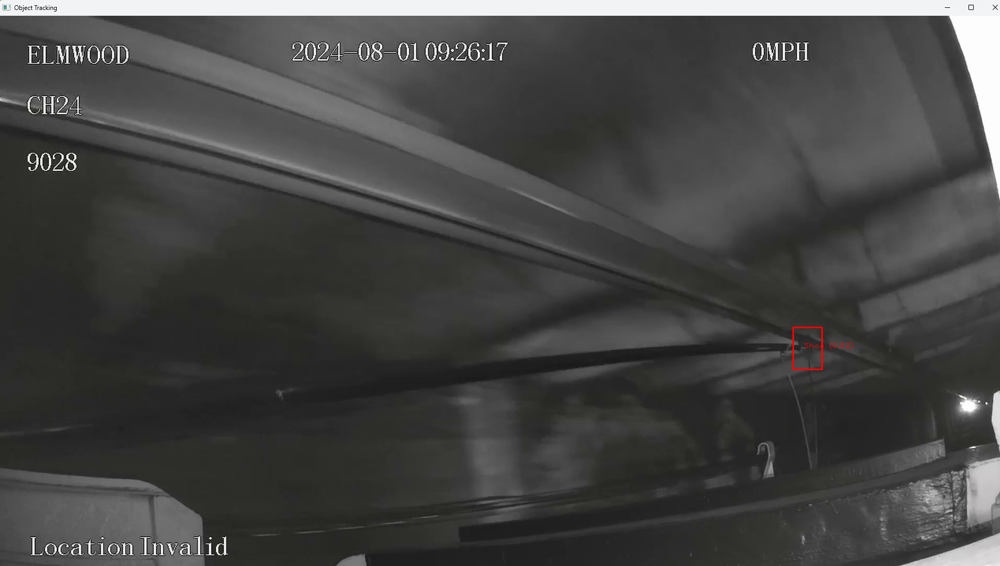

# Analyze Real-World DVR Video

## System Environment  

- **Operating System**: WSL Ubuntu 24.04.1 LTS
- **GPU**: NVIDIA Geforce RTX 4070 Laptop
- **CUDA Version**: 12.7
- **Python Version**: python3.11
- **Tensorflow**: 2.18.0 
- **MiniPupper** (Raspberry Pi Compute Module 4)

## Environment Setup

Build a virual environment to mangae the project
```sh
sudo apt install python3.11 python3.11-pip
sudo apt update

python3.11 -m venv mediapipe
source mediapipe/bin/activate
```

Install dependencies using:  

```sh
pip install -r requirements.txt
```

##  Usage
### Create dataset
Selected dataset from video with in 1 frame for every 0.5 seconds

```sh
python ConvertVideoToImage.py
```

After sampled the image, used Roboflow to label.

### Training customer object detection model

The code is retrived from [Object detection model customization guide](https://ai.google.dev/edge/mediapipe/solutions/customization/object_detector)

For training model run:

```sh
python train.py
```

### Apply object detection on image

Object detected by using the customer training model

```sh
python testing.py
```

### Apply object detection on video

Object detected by using the customer training model

```sh
python object_tracking.py
```
### Apply object detection on stream video with sever API

Using Raspberry pi camera to capture the stream video. Run this on MiniPupper to start sever API:

```sh
python camera_sever_api.py
```

Run this on PC to process the stream video to active object detection:

```sh
python camera_client.py
```
### Apply object detection on camera

Run all the thing on raspberry pi and remote connect to rapsberry pi to motor the stream video

```sh
python3 detect_handless.py \
  --model model_384_int8.tflite \
  --maxResults 2 \
  --scoreThreshold 0.3
```

## Results
MediaPipe detection of trolley shoe with bounding box and confidence score

 
